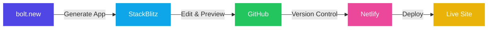

# Building and Deploying Modern Web Applications Using AI

A Beginner's Guide to bolt.new, StackBlitz, GitHub, and Netlify

  
    Press Space for next page <carbon:arrow-right class="inline"/>
  

  <a href="https://github.com/slidevjs/slidev" target="_blank" alt="GitHub" title="Open in GitHub"
    class="text-xl slidev-icon-btn opacity-50 !border-none !hover:text-white">
    <carbon-logo-github />
  </a>

---
layout: intro
---

# Kevin Vandever
## AI Technology Consultant

- 20+ years leading technical innovation and digital transformation
- Published author and technical mentor
- Specialist in AI integration and workflow automation
- Expert in bridging technical and business needs

  

    

      <carbon:logo-linkedin class="inline mr-1"/> https://www.linkedin.com/in/kevinvandever/
    

    

      <carbon:globe class="inline mr-1"/> Website: https://vandevercollective.com
    

  

---
layout: default
background: 'linear-gradient(to right bottom, #2a1f3d, #2d2047, #302151, #32225b, #342365)'
class: 'text-white'
---

# Workshop Overview

### The Challenge
- Complex development cycles
- Slow traditional methods
- Integration challenges
- Manual process risks

### The Solution
- AI-powered automation
- Streamlined workflows
- Modern version control
- Best practices

### Key Benefits
- Rapid development
- Error reduction
- Better code quality
- Faster deployments

### Expected Outcomes
- Production-ready apps
- Automated processes
- Enhanced skills
- Modern practices

---
layout: default
background: 'linear-gradient(to right bottom, #2a1f3d, #2d2047, #302151, #32225b, #342365)'
class: 'text-white'
---

# What We Will Cover

### Project Creation

- AI-powered Development
  - Prompting and template selection
  - Project scaffolding
  - Code generation

- Development Environment
  - StackBlitz setup
  - Live preview
  - Basic customizations

### Deployment & Control

- Version Control
  - GitHub basics
  - Repository setup
  - Basic workflow

- Deployment Process
  - Netlify setup
  - Domain configuration
  - Deploy settings

---
layout: center
background: 'linear-gradient(to right bottom, #2a1f3d, #2d2047, #302151, #32225b, #342365)'
class: 'text-white'
---

# Topics for Another Day...

  Advanced Testing
  GitHub Actions
  Advanced Netlify Features
  Database Design
  Security
  Modern Tech Stacks
  Performance Optimization
  API Architecture

  Don't worry! We'll focus on the essentials today.

---
layout: default
background: 'linear-gradient(to right bottom, #2a1f3d, #2d2047, #302151, #32225b, #342365)'
class: 'text-white'
---

# Workshop Timeline

### Hour 1
- AI Development Basics
- Project Setup
- Code Generation

### Hour 2
- GitHub Integration
- StackBlitz Setup
- Development Flow

### Hour 3
- Netlify Deployment
- Best Practices
- Next Steps

  Each section includes hands-on practice and interactive Q&A

---
layout: default
background: 'linear-gradient(to right bottom, #2a1f3d, #2d2047, #302151, #32225b, #342365)'
class: 'text-white'
---

# Example Projects

### Business Solutions

  <a href="https://vandevercollective.com/" target="_blank" class="block p-4 bg-white/5 rounded-lg hover:bg-white/10 transition-colors">
    <h4 class="text-blue-300 text-lg mb-2">Vandever Collective</h4>
    
Professional business website with modern design and AI integration

  </a>

### AI Applications

  <a href="https://pocket-somm.netlify.app/" target="_blank" class="block p-4 bg-white/5 rounded-lg hover:bg-white/10 transition-colors">
    <h4 class="text-green-300 text-lg mb-2">Pocket Sommelier</h4>
    
AI-powered wine recommendation system

  </a>

### Analysis Tools

  <a href="https://scintillating-banoffee-9c2440.netlify.app/" target="_blank" class="block p-4 bg-white/5 rounded-lg hover:bg-white/10 transition-colors">
    <h4 class="text-purple-300 text-lg mb-2">Comment Analysis</h4>
    
AI-driven comment sentiment analysis tool

  </a>

### Migration Examples

  <a href="https://color-analysis-migration.netlify.app/" target="_blank" class="block p-4 bg-white/5 rounded-lg hover:bg-white/10 transition-colors">
    <h4 class="text-pink-300 text-lg mb-2">Color Analysis</h4>
    
Demonstration of successful platform migration

  </a>

  All examples built using the tools and techniques we'll cover today

---
layout: center
class: text-center
background: 'linear-gradient(to right bottom, #2a1f3d, #2d2047, #302151, #32225b, #342365)'
---

# Let's Start Building! 🚀

<h3 class="text-2xl text-blue-300 mb-4">Time to Put Theory into Practice</h3>

Head over to <a href="https://bolt.new" target="_blank" class="text-blue-300 hover:text-blue-400">bolt.new</a> to start building your own AI-powered web application!

  

    <carbon:code class="inline-block mr-2"/> Write Code
  

  

    <carbon:development class="inline-block mr-2"/> Build Features
  

  

    <carbon:deploy class="inline-block mr-2"/> Deploy Live
  

